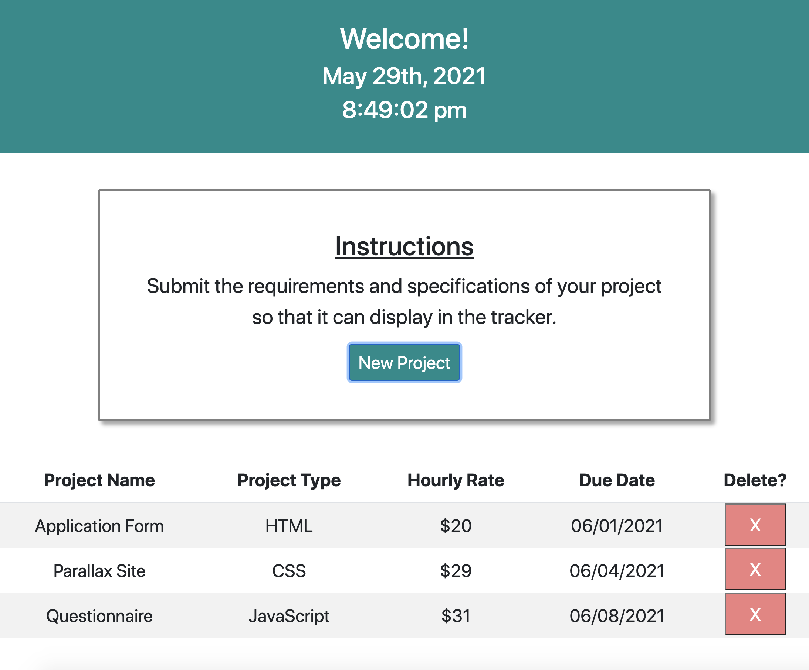

# Project Tracker

A front-end project tracker that helps freelance web developers efficiently manage their workflow.

## Description

This website utilizes various front-end technologies and libraries, including HTML5, CSS3, Bootstrap, JavaScript, jQuery, and the jQuery UI library. Users can enter project information by filling out a form (displayed on a modal), then that information is dynamically added to the table on the page. After a user completes a project, the user can then delete it from the table.

Building this project was a good reminder that information can be deleted based on considering a button's class, and that particular button's relation to other parts of the DOM (in this case, the table row that it is in). While I have become accustomed to deleting data through MySQL or MongoDB, it was interesting to remember that this option is a good front-end solution.

A couple ideas for future development include:

- Polishing the UI
- Turning the website into a full-stack application that uses a database

## Technologies Used

- HTML5
- CSS3
- Bootstrap
- JavaScript
- jQuery
- jQuery UI Library

## Table of Contents

- [Installation](#Installation)
- [Usage](#Usage)
- [License](#License)
- [Contributing](#Contributing)
- [Tests](#Tests)
- [Questions](#Questions)
            
## Installation

The application can be viewed live here:

No installation steps are necessary.

A view of the home page:

## Usage

This application is intended to track freelance projects for one user.

## License

This project has not yet been licensed, and thus, standard copyright laws apply.
            
## Contributing

Valerie Russell is the sole contributor to this project.
            
## Tests

There are currently no tests written for this project.
            
## Questions

If you have any questions about this application my GitHub username is vruss14 and you can view my GitHub profile at https://github.com/vruss14.

If you have additional questions, feel free to reach out to me at vruss14@gmail.com.

